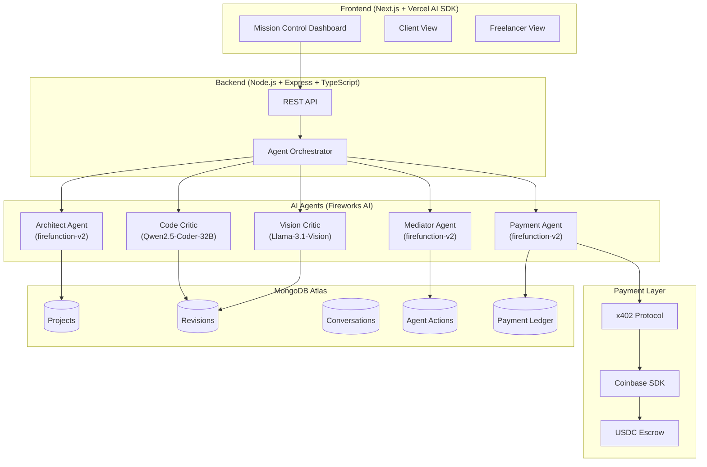
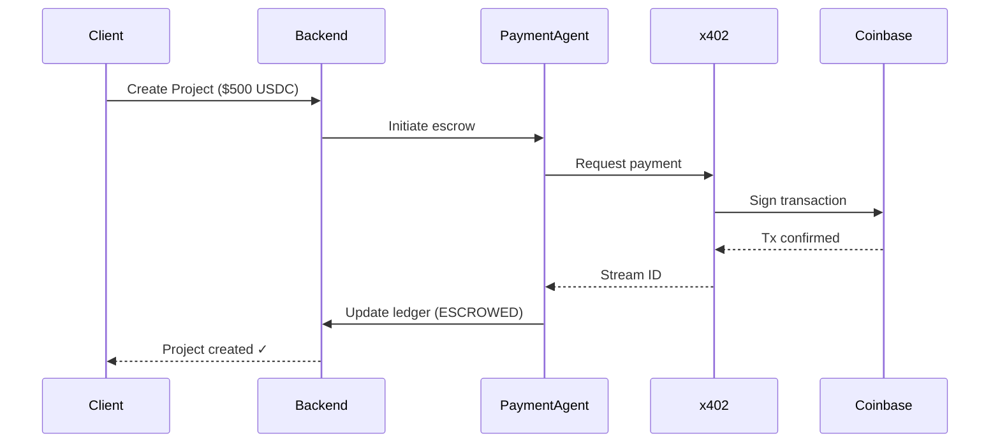
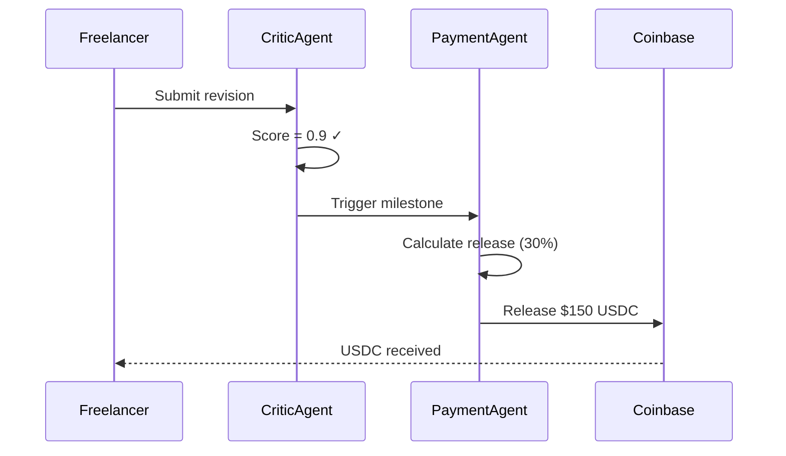

# Syntropy Protocol - Technical PRD

> **Version**: 1.0 | **Status**: Hackathon Build | **Date**: January 2026

---

## 1. Executive Summary

**Syntropy** is an autonomous mediation layer for the freelance economy. It eliminates "management overhead" by using a network of specialized AI agents that:

- **Negotiate requirements** with clients through conversational AI
- **Verify work quality** before involving the client (Gatekeeper pattern)
- **Automate payments** via x402 protocol for trustless settlement

**Demo Priority**: Multi-agent coordination via MongoDB as a shared "whiteboard"

---

## 2. Vision & Problem Statement

### The Problem
| Pain Point | Who it Affects |
|------------|----------------|
| Vague requirements → scope creep | Clients & Freelancers |
| Constant "update anxiety" | Clients |
| Late/disputed payments | Freelancers |
| Noise from incomplete work | Clients |

### The Solution
Agents handle the friction. Clients only see **verified work** (score ≥8/10). Freelancers get **structured specs** and **instant payouts** upon approval.

---

## 3. User Personas

| Persona | Role | Goal | Pain Point |
|---------|------|------|------------|
| **The Visionary** | Client | Execute project with zero micro-management | Scope creep, update anxiety |
| **The Specialist** | Freelancer | Code in flow state, get paid instantly | Vague requirements, late payments |

---

## 4. System Architecture



---

## 5. AI Agents Specification

### 5.1 Architect Agent
**Purpose**: Convert client's vague ideas → structured requirements with acceptance criteria

| Property | Value |
|----------|-------|
| **Model** | `firefunction-v2` |
| **Mode** | Conversational (multi-turn) |
| **Input** | Client messages |
| **Output** | `ArchitectOutput` (structured brief, acceptance criteria, tech stack, hours) |

**Conversational Flow**:
1. Greet client, ask first clarifying question
2. Track gathered info: `has_tech_stack`, `has_features`, `has_timeline`, `has_design_preferences`
3. After 3-5 questions, mark `is_complete: true`
4. Generate final requirements document

**Output Schema**:
```json
{
  "structured_brief": "markdown string",
  "acceptance_criteria": ["testable requirement strings"],
  "technical_stack": ["recommended technologies"],
  "estimated_hours": 40,
  "reasoning": "explanation of assumptions"
}
```

---

### 5.2 Code Critic Agent
**Purpose**: Static analysis, logic flaw detection, requirements matching

| Property | Value |
|----------|-------|
| **Model** | `Qwen2.5-Coder-32B` (via Fireworks AI) |
| **Trigger** | Freelancer submits code revision |
| **Gatekeeper** | Score < 0.8 → feedback to freelancer only |

**Scoring Guidelines**:
| Score Range | Meaning |
|-------------|---------|
| 0.0 - 0.3 | Major issues, fundamentally broken |
| 0.4 - 0.5 | Partially complete, significant gaps |
| 0.6 - 0.7 | Most requirements met, quality issues |
| 0.8 - 0.9 | Ready for client review ✓ |
| 1.0 | Exceptional, exceeds requirements |

**Output Schema**:
```json
{
  "score": 0.85,
  "feedback": "detailed analysis",
  "blockers": ["must-fix issues"],
  "suggestions": ["optional improvements"],
  "reasoning": "scoring rationale"
}
```

---

### 5.3 Vision Critic Agent
**Purpose**: Compare UI screenshots/designs against original specs

| Property | Value |
|----------|-------|
| **Model** | `Llama-3.1-Vision` or `Pixtral-12B` |
| **Input** | Screenshot + design spec |
| **Use Case** | UI/UX verification |

**Evaluation Criteria**:
- Layout matches mockup
- Color scheme adherence
- Typography consistency
- Responsive behavior
- Accessibility compliance

---

### 5.4 Mediator Agent
**Purpose**: Generate professional client notifications when work passes verification

| Property | Value |
|----------|-------|
| **Model** | `firefunction-v2` |
| **Trigger** | Revision score ≥ 0.8 |
| **Output** | Subject, message, urgency, action_required |

**Output Schema**:
```json
{
  "subject": "Your Landing Page is Ready for Review",
  "message": "The freelancer has completed...",
  "urgency": "medium",
  "action_required": true
}
```

---

### 5.5 Payment Agent (Phase 4)
**Purpose**: Handle autonomous escrow, milestone releases, and scope change negotiations

| Property | Value |
|----------|-------|
| **Model** | `firefunction-v2` |
| **Capabilities** | Escrow management, delta calculation, x402 signing |

**Functions**:
1. **Calculate milestone release** based on verified work
2. **Negotiate "delta"** when scope changes detected
3. **Execute x402 payment** via Coinbase SDK

---

## 6. MongoDB Collections Schema

### 6.1 Projects
```javascript
{
  _id: ObjectId,
  project_code: "SYN-001",          // Unique identifier
  
  // Participants
  client_id: ObjectId,
  freelancer_id: ObjectId,
  freelancer_email: "dev@example.com",
  
  // Project Details
  title: "E-commerce Landing Page",
  raw_description: "I need a landing page...",
  
  // AI-Generated Requirements (by Architect)
  requirements: {
    structured_brief: "## Overview\n...",
    acceptance_criteria: ["User can...", "Page loads in < 3s"],
    technical_stack: ["React", "Tailwind", "Vercel"],
    estimated_hours: 40,
    architect_reasoning: "Assumed mobile-first..."
  },
  
  // Status
  status: "CREATED" | "REQUIREMENTS_GENERATED" | "IN_PROGRESS" | "IN_REVIEW" | "APPROVED" | "COMPLETED",
  
  // Quality Tracking
  current_revision: 3,
  highest_score: 0.85,
  
  // Budget & Payments
  budget_usdc: 500,
  released_usdc: 150,
  payment_status: "ESCROWED" | "PENDING_RELEASE" | "RELEASED",
  
  // Timestamps
  created_at: Date,
  requirements_generated_at: Date,
  started_at: Date,
  completed_at: Date
}
```

### 6.2 Revisions
```javascript
{
  _id: ObjectId,
  project_id: ObjectId,
  freelancer_id: ObjectId,
  revision_number: 3,
  
  // Submitted Work
  files: [
    { filename: "app.tsx", content: "...", language: "typescript" }
  ],
  notes: "Implemented responsive design...",
  
  // Critic Evaluation
  critic_score: 0.85,
  critic_feedback: "Well-structured code...",
  critique_reasoning: "...",
  blockers: [],
  suggestions: ["Consider lazy loading"],
  
  // Gatekeeper
  visible_to_client: true,      // Only if score >= 0.8
  client_notified: true,
  
  status: "PENDING_REVIEW" | "REVIEWED" | "APPROVED" | "REJECTED",
  submitted_at: Date
}
```

### 6.3 Conversations
```javascript
{
  _id: ObjectId,
  project_id: ObjectId,
  client_id: ObjectId,
  
  messages: [
    { role: "user", content: "I need a landing page", timestamp: Date },
    { role: "assistant", content: "What's your target audience?", timestamp: Date }
  ],
  
  status: "GATHERING_INFO" | "READY_TO_GENERATE" | "COMPLETED",
  
  gathered_info: {
    has_tech_stack: true,
    has_features: true,
    has_timeline: false,
    has_design_preferences: true,
    questions_asked: 4
  },
  
  last_message_at: Date,
  completed_at: Date
}
```

### 6.4 Agent Actions (Audit Log)
```javascript
{
  _id: ObjectId,
  agent: "ARCHITECT" | "CODE_CRITIC" | "VISION_CRITIC" | "MEDIATOR" | "PAYMENT",
  action: "STARTED_CONVERSATION" | "GENERATED_REQUIREMENTS" | "SCORED_REVISION" | "NOTIFIED_CLIENT",
  
  project_id: ObjectId,
  revision_id: ObjectId,           // Optional
  
  reasoning: "...",
  confidence: 0.85,
  model_used: "firefunction-v2",
  
  latency_ms: 1250,
  tokens_used: 2048,
  result: { ... },
  
  created_at: Date
}
```

### 6.5 Payment Ledger (Phase 4)
```javascript
{
  _id: ObjectId,
  project_id: ObjectId,
  
  transaction_type: "ESCROW_DEPOSIT" | "MILESTONE_RELEASE" | "DELTA_TOPUP" | "FINAL_SETTLEMENT",
  amount_usdc: 150,
  
  // x402 Integration
  x402_stream_id: "...",
  x402_facilitator_url: "https://api.coinbase.com/x402",
  coinbase_tx_hash: "0x...",
  
  // State
  status: "PENDING" | "CONFIRMED" | "FAILED",
  
  triggered_by: "PAYMENT_AGENT" | "CLIENT_APPROVAL",
  created_at: Date,
  confirmed_at: Date
}
```

---

## 7. API Endpoints

### Authentication
| Method | Endpoint | Description |
|--------|----------|-------------|
| POST | `/api/auth/register` | Register as Client or Freelancer |
| POST | `/api/auth/login` | Login, returns JWT |
| GET | `/api/auth/me` | Verify token, get user |

### Projects
| Method | Endpoint | Description |
|--------|----------|-------------|
| POST | `/api/projects` | Create project (Client) |
| GET | `/api/projects` | List user's projects |
| GET | `/api/projects/:id` | Get project details |
| POST | `/api/projects/:id/approve` | Approve work (Client) |

### Conversational Architect
| Method | Endpoint | Description |
|--------|----------|-------------|
| POST | `/api/chat/:projectId/start` | Start architect conversation |
| POST | `/api/chat/:projectId/message` | Send message to architect |
| POST | `/api/chat/:projectId/generate` | Generate final requirements |
| GET | `/api/chat/:projectId` | Get conversation history |

### Revisions
| Method | Endpoint | Description |
|--------|----------|-------------|
| POST | `/api/revisions` | Submit work (Freelancer) |
| GET | `/api/revisions/:projectId` | Get project revisions |

### Payments (Phase 4)
| Method | Endpoint | Description |
|--------|----------|-------------|
| POST | `/api/payments/escrow` | Deposit to escrow |
| POST | `/api/payments/release/:revisionId` | Release milestone |
| GET | `/api/payments/:projectId/ledger` | Get payment history |

---

## 8. Payment Flow (x402 Protocol)

### 8.1 Escrow Flow


### 8.2 Milestone Release


### 8.3 Delta Negotiation (Scope Change)
When client requests work outside original spec:
1. **Payment Agent** detects scope change
2. Calculates "delta" cost based on new requirements
3. Proposes price adjustment to client
4. If approved, requests wallet "top-up"
5. Updates escrow with new total

---

## 9. Frontend Dashboard (Vercel AI SDK)

### 9.1 Mission Control Views

**Client Dashboard**:
- Active projects with status
- Real-time agent activity feed
- Verified submissions (score ≥ 8)
- Payment/escrow status
- Approve/reject actions

**Freelancer Dashboard**:
- Assigned projects
- Requirements documents
- Submit work interface
- Critic feedback (all scores visible)
- Payment history

### 9.2 Real-time Features (Vercel AI SDK)
- Streaming agent responses
- Live score updates
- Notification badges
- Agent "thinking" indicators

---

## 10. Tech Stack Summary

| Layer | Technology | Purpose |
|-------|------------|---------|
| **Frontend** | Next.js 15, Vercel AI SDK, Tailwind CSS | Dashboard |
| **Backend** | Node.js, Express, TypeScript | API Server |
| **AI - Architect** | Fireworks AI (firefunction-v2) | Requirements generation |
| **AI - Code Critic** | Fireworks AI (Qwen2.5-Coder-32B) | Code analysis |
| **AI - Vision Critic** | Fireworks AI (Llama-3.1-Vision) | UI verification |
| **Database** | MongoDB Atlas | State, memory, coordination |
| **Payments** | Coinbase SDK + x402 Protocol | Autonomous USDC settlement |
| **Auth** | JWT | User authentication |

---

## 11. Implementation Phases

### Phase 1: Multi-Agent Coordination (Priority ⭐⭐⭐)
- [ ] Split Critic into Code Critic + Vision Critic
- [ ] Implement model routing logic
- [ ] Add agent handoff via MongoDB
- [ ] Enhance `AgentAction` logging for demo

### Phase 2: Frontend Dashboard
- [ ] Initialize Next.js 15 with Vercel AI SDK
- [ ] Build Client Mission Control
- [ ] Build Freelancer workspace
- [ ] Implement real-time agent activity stream

### Phase 3: Enhanced Gatekeeper
- [ ] Vision Critic integration
- [ ] Screenshot comparison workflow
- [ ] Combined score from multiple critics

### Phase 4: Payment Integration
- [ ] Coinbase SDK setup
- [ ] x402 protocol integration
- [ ] Escrow logic
- [ ] Payment Agent implementation
- [ ] Delta negotiation

---

## 12. Success Metrics for Judging

| Metric | Description |
|--------|-------------|
| **Resilience** | System resumes 3-day project after server restart (MongoDB state) |
| **Autonomy** | Count of "interventions saved" (Critic handles vs Client involvement) |
| **Coordination** | Agents discover tasks via MongoDB, not hardcoded |
| **Efficiency** | Time from "Work Submitted" → "USDC Settled" |

---

## 13. Hackathon Pitch

> "We are building **Syntropy**. Most marketplaces are just 'directories.' Syntropy is an **Active Mediator**. By using Fireworks AI for the brains and Coinbase x402 for the heart, we've created a system where the AI takes the blame for feedback, handles the stress of money, and lets humans just focus on the creative 'Aha!' moments."

---

## 14. File References (Current Codebase)

| File | Purpose |
|------|---------|
| [architect.ts](file:///Users/yogyamehrotra/Desktop/Syntropy%20protocol/CVMongoDBHackathon/backend/src/agents/architect.ts) | Basic Architect Agent |
| [architect-conversational.ts](file:///Users/yogyamehrotra/Desktop/Syntropy%20protocol/CVMongoDBHackathon/backend/src/agents/architect-conversational.ts) | Conversational Architect flow |
| [critic.ts](file:///Users/yogyamehrotra/Desktop/Syntropy%20protocol/CVMongoDBHackathon/backend/src/agents/critic.ts) | Critic Agent with Gatekeeper |
| [mediator.ts](file:///Users/yogyamehrotra/Desktop/Syntropy%20protocol/CVMongoDBHackathon/backend/src/agents/mediator.ts) | Mediator Agent |
| [Project.ts](file:///Users/yogyamehrotra/Desktop/Syntropy%20protocol/CVMongoDBHackathon/backend/src/models/Project.ts) | Project MongoDB schema |
| [fireworks.ts](file:///Users/yogyamehrotra/Desktop/Syntropy%20protocol/CVMongoDBHackathon/backend/src/services/fireworks.ts) | Fireworks AI service |
